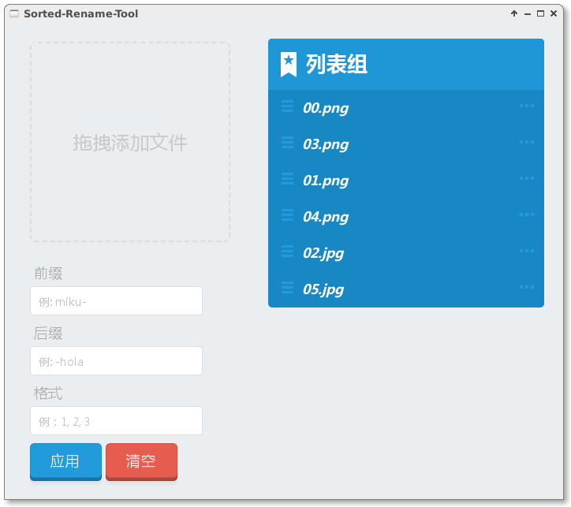

# sorted-rename-tool

A useful GUI tool for sort and rename files according to sequences.

一款手动排序，批量重命名的小工具。

# Screenshots

# Usage

1. Drop your file(s) to the tool.
2. Sort files in the list by yourself.
3. Add some rename rules (optional).
4. Click the button, your files would be renamed in order according to the list sequences.

# License

[MIT](LICENSE)

